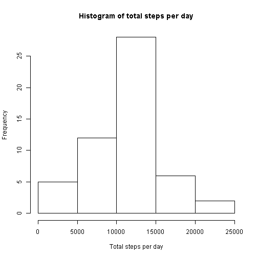
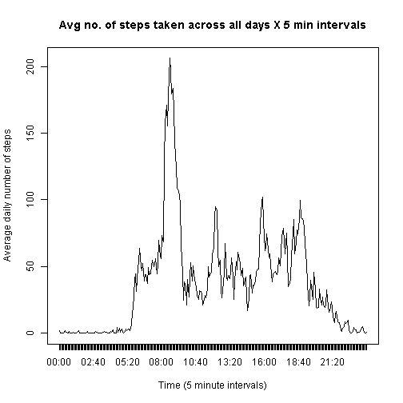
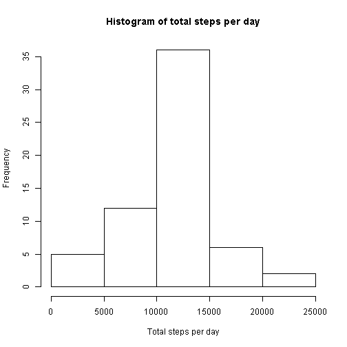
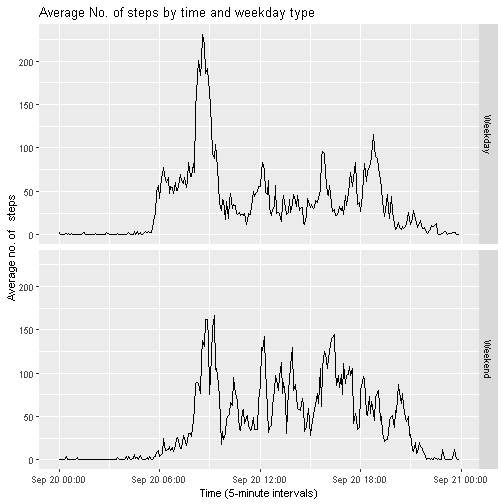

# Course 5 Reproducible Research - Course Project 1

## Loading and Preprocessing the data
Here is a preview of the loaded data:

```r
  act <- read.csv("activity.csv")
  head(act)
```

```
##   steps       date interval
## 1    NA 2012-10-01        0
## 2    NA 2012-10-01        5
## 3    NA 2012-10-01       10
## 4    NA 2012-10-01       15
## 5    NA 2012-10-01       20
## 6    NA 2012-10-01       25
```

Here is a version of the data with missing step entries taken out, and the interval field is converted to a factor (with preview):

```r
  act$interval <- as.factor(substr(as.POSIXct(sprintf("%04.0f",act$interval), format = '%H%M'),12,16))
    act.rmna <- act[!is.na(act$steps), ]
  head(act.rmna)
```

```
##     steps       date interval
## 289     0 2012-10-02    00:00
## 290     0 2012-10-02    00:05
## 291     0 2012-10-02    00:10
## 292     0 2012-10-02    00:15
## 293     0 2012-10-02    00:20
## 294     0 2012-10-02    00:25
```

## What is mean total number of steps taken per day?
### 1. Calculate the total number of steps taken per day

```r
        totalsteps <- tapply(act.rmna$steps,act.rmna$date,FUN = sum,na.rm=TRUE)
        totalsteps
```

```
## 2012-10-01 2012-10-02 2012-10-03 2012-10-04 2012-10-05 2012-10-06 
##         NA        126      11352      12116      13294      15420 
## 2012-10-07 2012-10-08 2012-10-09 2012-10-10 2012-10-11 2012-10-12 
##      11015         NA      12811       9900      10304      17382 
## 2012-10-13 2012-10-14 2012-10-15 2012-10-16 2012-10-17 2012-10-18 
##      12426      15098      10139      15084      13452      10056 
## 2012-10-19 2012-10-20 2012-10-21 2012-10-22 2012-10-23 2012-10-24 
##      11829      10395       8821      13460       8918       8355 
## 2012-10-25 2012-10-26 2012-10-27 2012-10-28 2012-10-29 2012-10-30 
##       2492       6778      10119      11458       5018       9819 
## 2012-10-31 2012-11-01 2012-11-02 2012-11-03 2012-11-04 2012-11-05 
##      15414         NA      10600      10571         NA      10439 
## 2012-11-06 2012-11-07 2012-11-08 2012-11-09 2012-11-10 2012-11-11 
##       8334      12883       3219         NA         NA      12608 
## 2012-11-12 2012-11-13 2012-11-14 2012-11-15 2012-11-16 2012-11-17 
##      10765       7336         NA         41       5441      14339 
## 2012-11-18 2012-11-19 2012-11-20 2012-11-21 2012-11-22 2012-11-23 
##      15110       8841       4472      12787      20427      21194 
## 2012-11-24 2012-11-25 2012-11-26 2012-11-27 2012-11-28 2012-11-29 
##      14478      11834      11162      13646      10183       7047 
## 2012-11-30 
##         NA
```

### 2. Make a histogram of the total number of steps taken each day

```r
        hist(totalsteps,xlab = "Total steps per day",                                   main = "Histogram of total steps per day")
```



### 3. Calculate and report the mean and median of the total number of steps taken per day

Mean number of steps taken per day:

```r
  mean(totalsteps,na.rm=TRUE)
```

```
## [1] 10766.19
```

Median number of steps taken per day:

```r
 median(totalsteps,na.rm=TRUE)
```

```
## [1] 10765
```

## What is the average daily activity pattern?

### 1. Make a time series plot of the 5-minute interval and the average number of steps taken, averaged across all days.

```r
  dailyavg <- tapply(act.rmna$steps,act.rmna$interval,mean)
  i <- attr(dailyavg,"dimnames")
  plot(dailyavg,type="l",xaxt="n",xlab="Time (5 minute intervals)",ylab="Average daily number of steps",main="Avg no. of steps taken across all days X 5 min intervals")
  axis(1,at = c(1:288),labels= i[[1]], tick=TRUE)
```



### 2.Which 5-minute interval, on average across all the days in the dataset, contains the maximum number of steps?

```r
  max.da <- which.max(dailyavg)
  i2 <- i[[1]]
  i2[[max.da]]
```

```
## [1] "08:35"
```

## Imputing Missing Values
### 1.Calculate and report the total number of missing values in the dataset.

```r
  sum(is.na(act$steps))
```

```
## [1] 2304
```

### 2.Devise a strategy for filling in all of the missing values in the dataset.
I'm going to use the mean of all populated data for the relevant 5-minute interval to do this.

```r
  act.na <- act[is.na(act$steps),]
    m <- as.data.frame(cbind(i2,dailyavg))
```

### 3.Create a new dataset that is equal to the original dataset but with the missing data filled in.

```r
act.na.m <- merge(act.na,m, by.x = "interval", by.y = "i2", all=TRUE)
        act.na.m$steps <- as.integer(as.character(act.na.m$dailyavg))
          act.na.m <- act.na.m[ ,c(1:3)]
            act2 <- rbind(act.rmna,act.na.m)
              head(act2)
```

```
##     steps       date interval
## 289     0 2012-10-02    00:00
## 290     0 2012-10-02    00:05
## 291     0 2012-10-02    00:10
## 292     0 2012-10-02    00:15
## 293     0 2012-10-02    00:20
## 294     0 2012-10-02    00:25
```

### 4.Make a histogram of the total number of steps taken each day and calculate the mean/median.

```r
        totalsteps2 <- tapply(act2$steps,act2$date,FUN = sum,na.rm=TRUE)
        hist(totalsteps2,xlab = "Total steps per day",                                   main = "Histogram of total steps per day")
```



Mean (with missing data filled in):

```r
  mean(totalsteps2,na.rm=TRUE)
```

```
## [1] 10749.77
```

Median (with missing data filled in):

```r
 median(totalsteps2,na.rm=TRUE)
```

```
## [1] 10641
```

The mean value from earlier in the assignment (where NAs were ignored) was 10,766, and the median was 10,765. The above shows that these measures are now smaller when the NA values have been filled in systematically using the 5-minute interval mean values.
  
## Are there differences in activity patterns between weekdays and weekends?

### 1.Create a new factor variable in the dataset with two levels - "weekday" and "weekend".

```r
  d <- as.Date(act2$date,format = "%Y-%m-%d")
    wd <- c("Monday","Tuesday","Wednesday","Thursday","Friday")
      act2.wd <- weekdays(d)
        wd.logical <- act2.wd %in% wd
          act2$day <- factor(wd.logical,levels=c(FALSE, TRUE), labels = c('weekend','weekday'))
            head(act2)
```

```
##     steps       date interval     day
## 289     0 2012-10-02    00:00 weekday
## 290     0 2012-10-02    00:05 weekday
## 291     0 2012-10-02    00:10 weekday
## 292     0 2012-10-02    00:15 weekday
## 293     0 2012-10-02    00:20 weekday
## 294     0 2012-10-02    00:25 weekday
```

### 2. Make a panel plot containing a time series plot of the 5-minute interval (x-axis) and the average number of steps taken, averaged across all weekday days or weekend days (y-axis).

```r
  dailyavg2 <- tapply(act2$steps,list(act2$interval,act2$day),mean)
  dailyavg3 <- c(dailyavg2[, 1],dailyavg2[,2])
    days <- c(rep("Weekend",times=288),rep("Weekday",times=288))
      five.minute.intervals <- c(i2,i2)
        dailyavg4 <- as.data.frame(cbind(five.minute.intervals,days,dailyavg3))
          dailyavg4$avgsteps <- as.numeric(as.character(dailyavg4$dailyavg3))
          dailyavg4 <- dailyavg4[ , c(1,2,4)]
            i3 <- paste(five.minute.intervals[1],"00",sep=":")
              for (i in 2:576) {
                  inext <- paste(five.minute.intervals[i],"00",sep=":")
                  i3 <- c(i3,inext)
              }
            library(ggplot2)
            dailyavg4$five.minute.intervals <- as.POSIXct(i3,format="%H:%M:%S")
            g <- ggplot(dailyavg4,aes(five.minute.intervals,avgsteps,group=1))
            g + geom_line() + facet_grid(days ~.) + labs(x = "Time (5-minute intervals)", y = "Average no. of   steps", 
              title = "Average No. of steps by time and weekday type")
```



              
